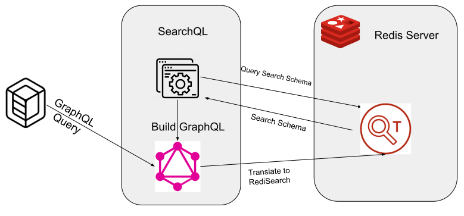

# GraphQL-Redis

A [GraphQL](https://graphql.org/) server backed by Redis

## Features

- Query Redis data using GraphQL
- Full text search on fields in Redis Data
- Numeric range queries
- Negative and optional matches
- Aggregate data for reporting
- Geographic matching
- Only minimal configuration required


## How this works

The GraphQL server queries RediSearch for the search schema then dynamically builds the GraphQL schema. 



### Data Formatting

Data is stored in a [Redis Hash data structure](https://redis.io/docs/manual/data-types/#hashes)

For example we have a list of gaming users and we want to be able to search these users by fields

#### user:jennifer82

|Field|Example Value|
|---|---|
|username|jennifer82|
|location|41.09822,120.74792|
|rating|591|
|playstyle|stationary,sniper|
|email|jennifer.lewis@example.com|

```
HSET user:jennifer82 username jennifer82  rating 591  email jennifer.lewis@example.com playstyle stationary,sniper location 122.4194,37.7749
```

### Create an Index on the fields you wish to search

```
FT.CREATE Gamers ON HASH PREFIX 1 user: SCHEMA username TEXT location GEO SORTABLE rating NUMERIC SORTABLE playstyle TAG email TAG
```

See [Tips and Tricks](.docs/SchemaTipsAndTricks.md) for more detailed information on creating a Redisearch schema

### Run the GraphQL server and point at the index

```
./graphql-redis --redis-host localhost --redis-port 6379 --redis-index Gamers
```

### View the auto generated documents in browser

http://localhost:8080/docs

### Run a query
```
curl -s -X POST  -H "Content-Type: application/json" --data '{"query": "{ ft(username:\"jennifer82\") {username,email,rating}}"}'   http://localhost:8080/graphql 
{
  "data": {
    "ft": [
      {
        "email": "jennifer.lewis@example.com",
        "rating": 591,
        "username": "jennifer82"
      }
    ]
  }
}
```

See [Querying](./docs/Queries.md) and [Aggregations](./docs/Aggregations.md) for more detailed query examples