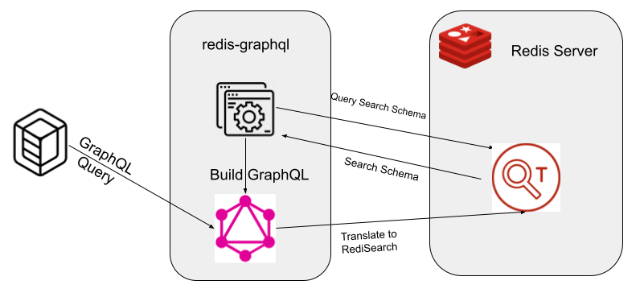

## Redisearch GraphQL Proxy

Translate GraphQL queries to RediSearch





### Note: This allows you to *only* search by TEXT fields now
#### Fixes are coming

### Testing


#### Start a redisearch docker container

```
docker run -p 6379:6379 redislabs/redisearch:latest
```

#### Load some sample data

```
python -m venv .venv
source .venv/bin/activate/
cd data
pip -r install requirements.txt
./dataload.py
```

#### Run the proxy

```
go run searchql.go
```

Query away!

```
curl -X POST  -H "Content-Type: application/json" \
   --data '{"query": "{ ft(hqstate:\"ca\", hqcity:\"san\", sector: \"Technology\") { company,ceo,sector,hqcity,hqstate } }" }' \
  http://localhost:8080/graphql
```