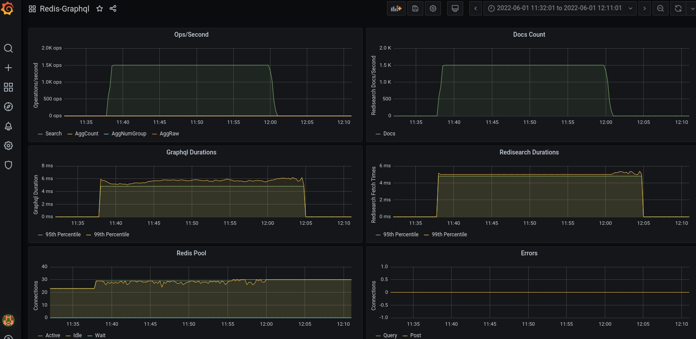

## Grafana/Prometheus setup




### Prometheus configuration

Add the following to your prometheus.yml and restart the process

```
  - job_name: 'graphql'
    static_configs:
      - targets: ['graphql.example.com:8080']
    relabel_configs:
      - source_labels: [__address__]
        regex: '(.*):8080'
        target_label: instance
        replacement: 'graphql'
```

### Grafana Dashboard

The [Dashboard Provided](./redis-graphql.json) can be modified to fit your environment